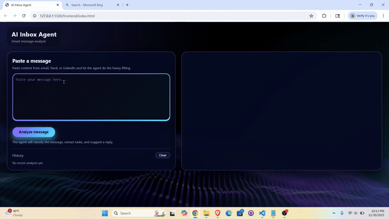
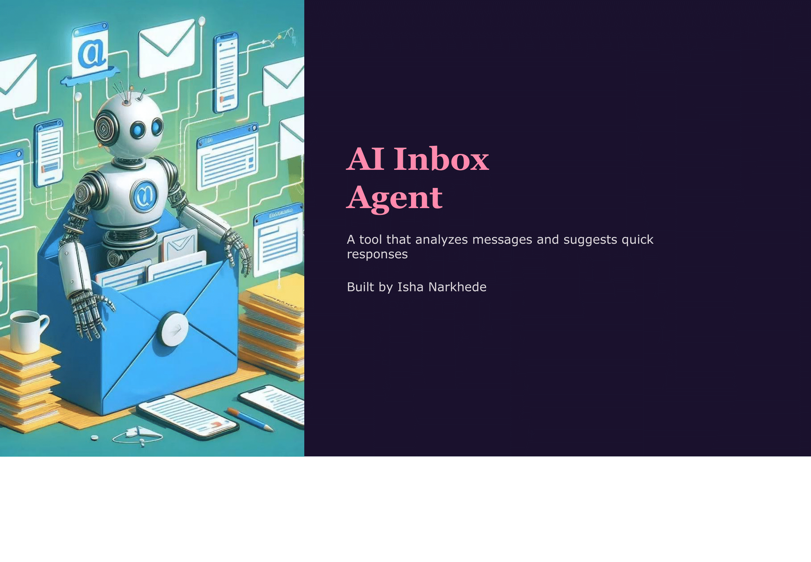
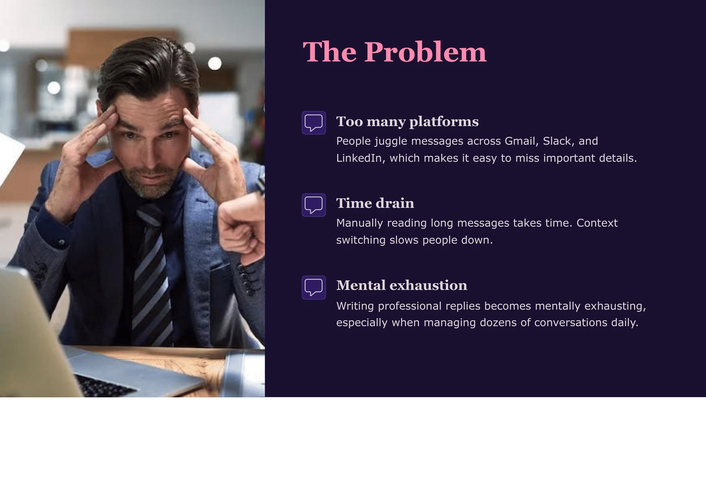
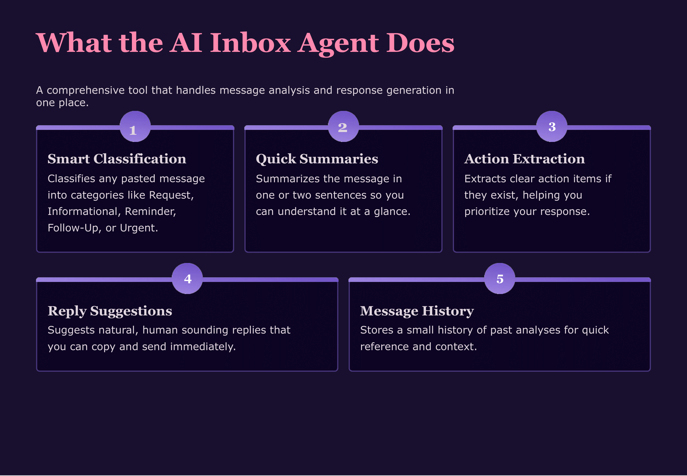
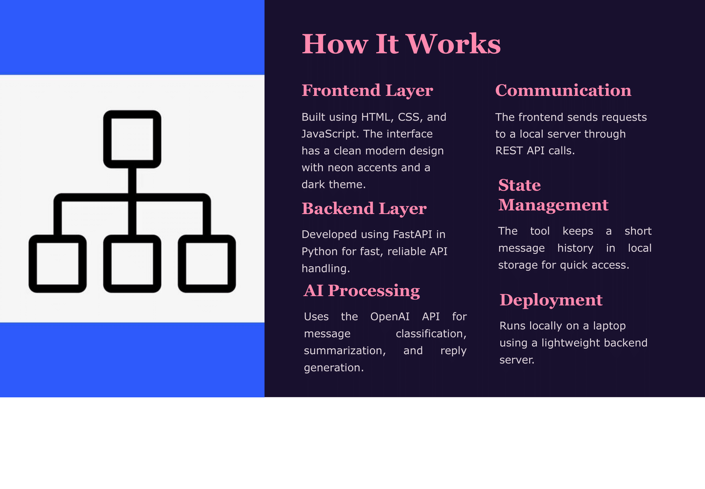
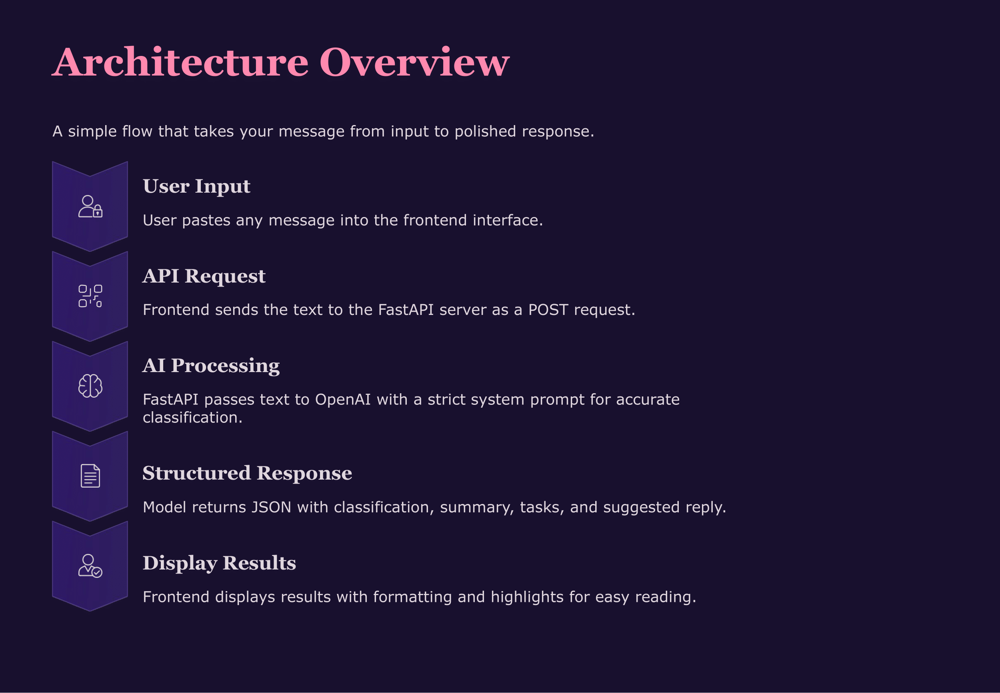
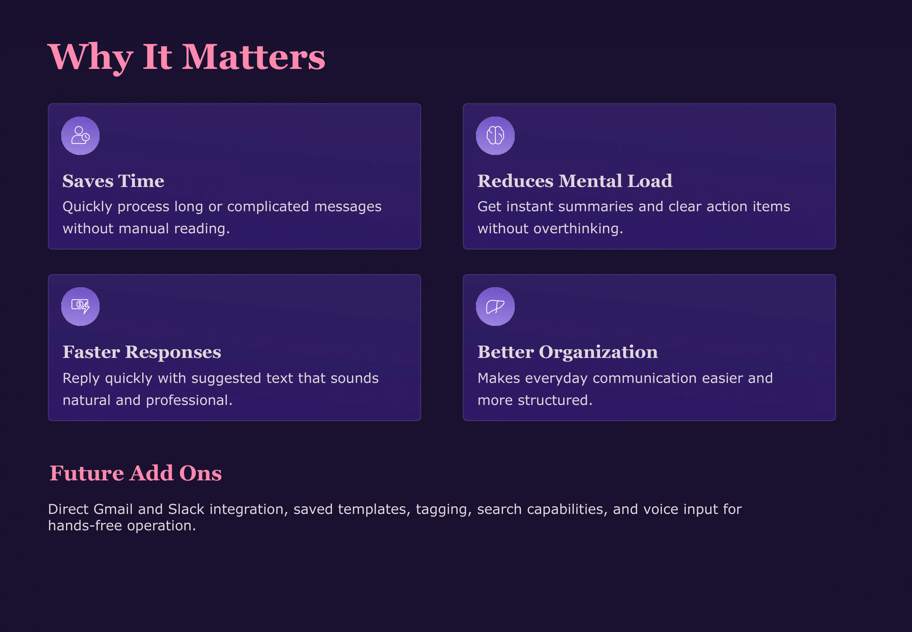

# 📨 AI Inbox Agent

> Paste any message - from Gmail, Slack, LinkedIn, anywhere - and in seconds get a **classification**, a **one-line summary**, **extracted action items**, and a **suggested reply** you can copy and send. A clean, zero-setup productivity tool for inbox overload, built with FastAPI and OpenAI.


<p align="center">
  
</p>

<p align="center">
  
</p>

---

## 🎯 The Problem

<p align="center">
  
</p>

Modern communication is fragmented across Gmail, Slack, LinkedIn, WhatsApp, and more. Reading long messages takes time, context-switching slows people down, and drafting professional replies dozens of times a day is mentally exhausting - especially when the same structure repeats ("understand → summarize → extract asks → reply").

## 💡 What It Does

<p align="center">
  
</p>

Five capabilities, delivered from a single paste-and-analyze input:

| # | Feature | What it does |
|---|---|---|
| 1 | **Smart Classification** | Categorizes the message as *Request · Informational · Reminder · Follow-Up · Urgent* |
| 2 | **Quick Summaries** | Summarizes in one or two sentences so you can grok the message at a glance |
| 3 | **Action Extraction** | Pulls out explicit asks and action items so nothing gets missed |
| 4 | **Reply Suggestions** | Drafts a natural, human-sounding reply ready to copy and send |
| 5 | **Message History** | Stores a short history of past analyses in local storage for quick reference |

---

## 🏗️ How It Works

<p align="center">
  
</p>

### Architecture

<p align="center">
  
</p>

```
User pastes message
       │
       ▼  POST /analyze
Vanilla-JS frontend  ────────────────►  FastAPI server (main.py)
                                               │
                                               ▼
                                         OpenAI API
                              (strict JSON system prompt →
                               classification + summary +
                               tasks + suggested reply)
                                               │
                                               ▼
                                      Structured JSON response
                                               │
       ┌───────────────────────────────────────┘
       ▼
Frontend renders:
  • classification badge
  • summary
  • action checklist
  • suggested reply (copy button)
       │
       ▼
localStorage (short history, no server DB)
```

**Design choices worth calling out:**

- **Strict system prompt** forces the model to return well-formed JSON every time, so the frontend can render it without fragile parsing
- **Zero database** - history lives in the browser's `localStorage` so there's nothing to provision or secure server-side
- **Separable tiers** - swap the LLM, swap the frontend, or host the backend remotely with no cross-cutting changes

## ✨ Why It Matters

<p align="center">
  
</p>

## 🛠️ Tech Stack

| Layer | Tools |
|---|---|
| Backend | Python 3.10+, **FastAPI**, Uvicorn |
| AI | **OpenAI API** (GPT-4 / GPT-3.5-turbo, configurable) |
| Frontend | HTML, CSS, vanilla JavaScript - no framework |
| State | Browser `localStorage` (short message history) |
| Styling | Custom dark theme with neon accents |

## 🚀 Getting Started

### 1. Clone and install

```bash
git clone https://github.com/Isha2605/ai-inbox-agent.git
cd ai-inbox-agent

# Create virtual environment
python -m venv venv
source venv/bin/activate         # macOS / Linux
# venv\Scripts\activate          # Windows

pip install -r requirements.txt
```

### 2. Add your OpenAI API key

> **⚠️ Never hard-code API keys in source files.** Use an environment variable.

Create a `.env` file in the repo root:

```env
OPENAI_API_KEY=sk-your-key-here
```

Get a key at <https://platform.openai.com/api-keys>. `.env` is gitignored so it won't be committed.

### 3. Run the FastAPI server

```bash
uvicorn main:app --reload
```

Then open `index.html` in your browser - it talks to the FastAPI server on `http://localhost:8000`.

## 📁 Project Structure

```
├── main.py                      # FastAPI server - /analyze endpoint
├── index.html                   # Frontend (paste box + results)
├── app.js                       # Frontend logic - API calls, rendering, history
├── style.css                    # Dark theme with neon accents
├── bg-neon.png                  # Background asset
├── demo.gif                     # Demo animation
├── AI-Inbox-Agent-1…6.png       # Presentation slides (cover, problem, features, architecture, why)
├── requirements.txt             # Python dependencies
├── .env.example                 # Template for API key setup
└── README.md
```

## 🔮 Future Add-Ons

*(from the deck, slide 6)*

- [ ] **Direct Gmail & Slack integration** - pull unread threads automatically instead of manual paste
- [ ] **Saved reply templates** - reuse common phrasings for frequent message types
- [ ] **Tagging** - user-defined labels on top of the 5 auto-classifications
- [ ] **Search** - full-text search over the message history
- [ ] **Voice input** - dictate the message for hands-free operation
- [ ] Swap OpenAI for a configurable backend (Anthropic Claude, local Ollama)

## 📬 Contact

**Isha Narkhede** · [Portfolio](https://isha-n-portfolio.netlify.app/) · [LinkedIn](https://linkedin.com/in/isha-narkhede) · ishajayant207@gmail.com

## 📝 License

MIT - see [LICENSE](LICENSE).
